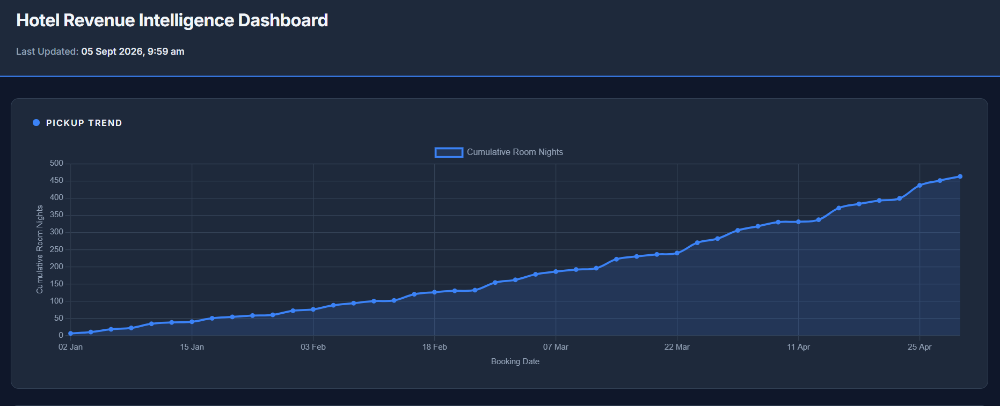
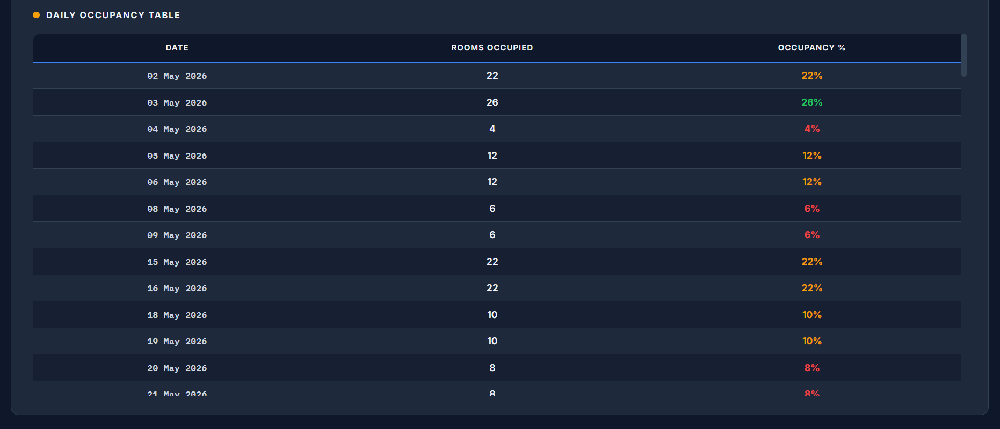
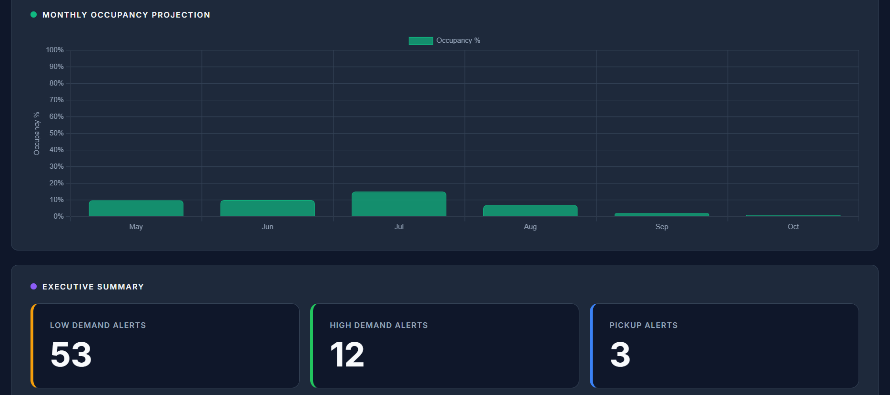
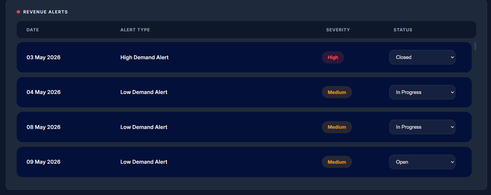

# Hotel Demand Monitoring and Alert Engine

A web-based hotel demand monitoring system that analyses booking and occupancy data, identifies demand patterns, generates alerts, and presents the results through an interactive dashboard.

This project was developed as part of an internship at Webstorm Information Technology Pvt. Ltd.

---

## Overview

Hotels need to keep track of their booking activity and occupancy levels to understand changes in demand. When demand increases or decreases significantly, it is useful to identify these changes early so that appropriate decisions can be made.

The **Hotel Demand Monitoring and Alert Engine** was developed to address this by providing a centralized dashboard for monitoring hotel demand.

The system processes booking data, calculates occupancy, analyses pickup trends, and generates alerts for high-demand and low-demand periods. The alerts also include recommendations and can be managed through different status stages.

---

## Objectives

The main objectives of the project are:

- Monitor hotel booking and occupancy data.
- Calculate and display daily occupancy levels.
- Analyse booking pickup trends over time.
- Identify high-demand and low-demand periods.
- Automatically generate alerts based on defined thresholds.
- Provide recommendations along with generated alerts.
- Allow users to update and track the status of alerts.
- Present important demand information through an interactive dashboard.
- Make hotel demand information easier to understand and monitor.

---

## Key Features

### 1. Occupancy Monitoring

The system calculates hotel occupancy based on the number of rooms occupied compared to the total available rooms.

The calculated occupancy is displayed through:

- Daily occupancy data
- Occupancy summaries
- Monthly occupancy charts
- Dashboard statistics

---

### 2. Pickup Trend Analysis

The system monitors booking pickup to understand how booking activity changes over time.

The pickup trend helps identify:

- Increasing booking activity
- Decreasing booking activity
- Sudden increases in bookings
- Periods of stronger or weaker demand

A sudden increase in pickup can indicate that demand is increasing and may require attention.

---

### 3. Demand Alerts

The alert engine automatically identifies specific demand conditions and generates alerts.

The current system includes:

- **Low Demand Alert** – generated when occupancy falls below the defined threshold.
- **High Demand Alert** – generated when occupancy exceeds the defined threshold.
- **Pickup Spike Alert** – generated when there is an unusual increase in booking activity.

Each alert contains information such as the date, alert type, severity, recommendation, and current status.

---

### 4. Alert Recommendations

Alerts are accompanied by recommendations based on the type of demand condition detected.

For example, a low-demand condition can indicate the need for promotional activity or closer monitoring, while a high-demand condition can indicate an opportunity to review pricing or inventory decisions.

The recommendations can be expanded from the alert table for more details.

---

### Alert Status Workflow

Generated alerts can be managed through a simple status workflow:

**Open → In Progress → Reviewed → Closed**

Users can update the status of an alert directly from the dashboard. The updated status is stored in the database and remains available after refreshing the application.
